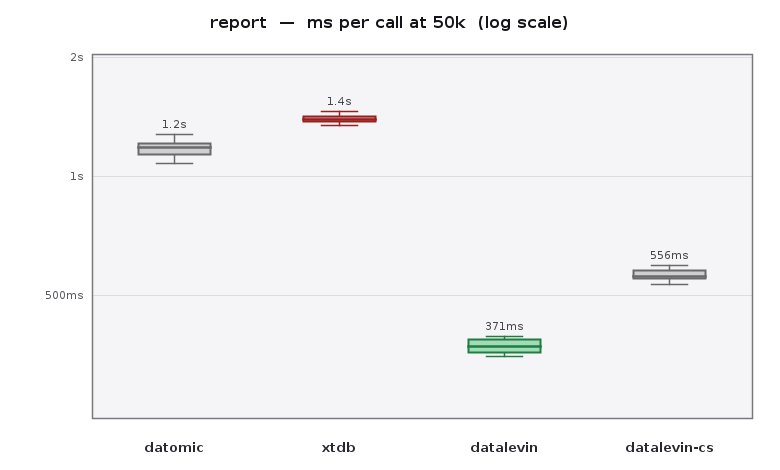
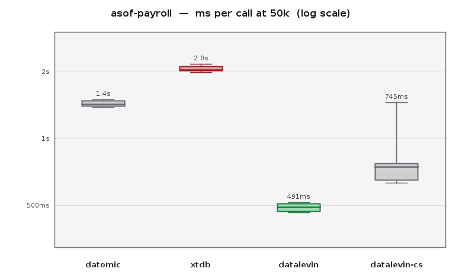
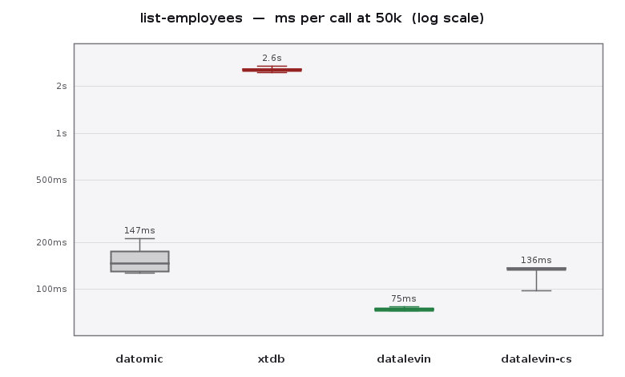
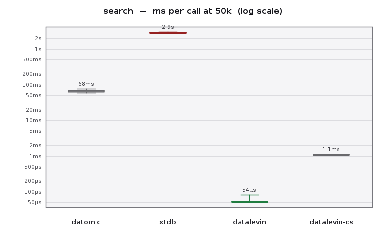
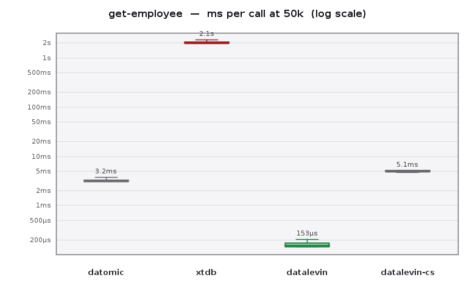
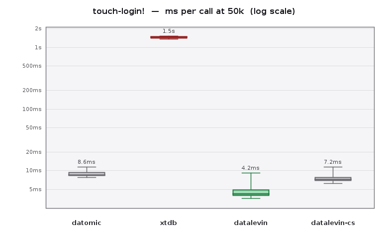

# HR Triad

One toy HR registry, implemented three times against three Clojure-world
databases — **Datomic Pro**, **XTDB 2**, and **Datalevin** — with identical
requirements and a deliberately identical UI (`web.clj` is byte-for-byte the
same file in all three apps). Every divergence lives in `src/hr/db.clj`,
because the divergence is the point: the same domain, filtered through three
philosophies of state and time, produces three different *schemas*, not just
three different client libraries.

The requirements: employee CRUD, department assignment with an effective
date, a salary timeline supporting **backdated corrections**, an "as-of"
payroll view along both time axes ("what was true on X?" vs "what did we
*know* on X?"), full-text search of review notes, GDPR-grade PII purge,
a per-department report, and a churny `last-login` field.

## Running

First generate the seed (git-ignored — not committed): from the repo root,
`clojure -M scripts/gen_seed.clj 50000` writes `seed.edn` (any size; each app
auto-loads it on first run). See [§9 Bulk load](#9-bulk-load-how-each-engine-ingests-at-scale)
for why the size matters.

Each app: `cd <app> && guix shell openjdk@21:jdk clojure-tools -- clojure -M:run`

| app             | port | needs first                                                                     |
|-----------------|------|---------------------------------------------------------------------------------|
| `datomic-app`   | 3001 | a dev transactor — see below (built from the in-repo package, served on `4334`) |
| `xtdb-app`      | 3002 | an XTDB node — see below (built from the in-repo package, served on `15432`)    |
| `datalevin-app` | 3003 | nothing — the database is a directory (`data/hr-db`) inside the app             |

That table is already the first lesson: **ops footprint**. Datomic needs a
transactor process; XTDB needs a node; Datalevin needs a `require`.

### Bringing up the XTDB node

`xtdb-app` ships its own [Guix](https://guix.gnu.org) package definition —
`xtdb-app/xtdb.scm` plus its pinned `xtdb-deps.lock` — so no pre-installed
`xtdb-standalone` binary is assumed; a clone plus Guix is self-sufficient.
From `xtdb-app/`, in one shell:

```
guix shell -f xtdb.scm -- xtdb-standalone -f config.yaml
```

That builds the standalone node from source (a cache hit once built) and runs
it with the tracked `config.yaml` — pgwire on `15432` (not the default 5432,
which may collide with a real PostgreSQL), writing its log and buffers under
`xtdb-app/data/` (git-ignored). Then, in another shell, start the app with the
line above.

### Bringing up the Datomic transactor

`datomic-app` ships its own Guix package definition — `datomic-app/datomic-pro.scm`
(a repackage of the official Datomic Pro zip) — plus `datomic-app/dev-transactor.sh`,
so no pre-installed `datomic-transactor` is assumed. From `datomic-app/`:

```
./dev-transactor.sh
```

The transactor `cd`s into its read-only store install dir before reading its
properties, so `data-dir`/`log-dir`/`pid-file` must be **absolute** — the
script derives them from its own location, writes an effective properties file
under `datomic-app/data/` (git-ignored), and launches the transactor from the
in-repo package on `4334`. Then, in another shell, start the app; the peer
connects to `datomic:dev://localhost:4334/hr-triad`.

### Runtime wiring

Each app's stateful runtime is an [integrant](https://github.com/weavejester/integrant)
system declared in `resources/system.edn` — the same four-component graph
everywhere:

```
:hr.db/conn → :hr.db/migrated → :hr.web/handler → :hr.web/server
```

`:hr.db/migrated` runs the migrations and legacy seed and yields the
ready-to-use handle (in the Datalevin app this is also where the
connection is reopened so the fulltext engine sees the migrated schema).
`hr.db` and `hr.web` are stateless — every function takes the db handle
explicitly. SIGTERM halts the system in reverse order.

Halting `:hr.db/conn` is its own three-way contrast: Datomic calls
`d/release` (freeing a cached handle to a database that lives in the
transactor), Datalevin calls `d/close` (this process IS the database —
closing flushes LMDB), and XTDB closes its HikariCP connection pool (the
database itself is someone else's process — the node — so only the
client-side connections are released, nothing is flushed).

## Where the same requirement produced different designs

### 1. Time: the fork that reshapes the schema

*Requirement: salary timeline, backdated corrections, both as-of axes.*

- **Datalevin** has no history at all — mutation is mutation. The only way
  to keep a timeline is to reify salary changes as event entities carrying
  both dates:

  ```clojure
  {:salary/employee eid :salary/amount 77000
   :salary/effective "2025-03-01"     ; valid time, by hand
   :salary/recorded  "2026-07-14"}    ; knowledge time, by hand
  ```

  Interesting consequence: because the events carry *both* dates, the app
  can answer both as-of questions — app-level bitemporality. The engine
  contributes nothing; it also can't corrupt it.

- **Datomic** natively records exactly one timeline — transaction time
  (`d/as-of`, `d/history`). The valid/effective axis must still be reified
  into the same event entities as Datalevin. What Datomic adds is an
  *unforgeable* knowledge axis: `d/as-of` rewinds the entire database, and
  no application bug can backdate it.

- **XTDB** makes both axes engine-native, and the event entities *dissolve*.
  Salary is just a column; a backdated correction is:

  ```sql
  UPDATE employees FOR VALID_TIME FROM DATE '2025-03-01'
  SET salary = 77000 WHERE _id = ?
  ```

  The same statement handles a raise from today, a scheduled future raise,
  and a backdated fix. The salary "timeline" in the UI is just the row's
  valid-time history; the recorded column falls out of `_system_from` for
  free. The reified-event *discipline* — a schema-design rule you must
  remember in the other two — becomes a database feature.

Verified live in all three: after correcting a salary to be effective
2025-03-01, "payroll on 2025-03-15" shows the corrected figure, while
"payroll on 2025-03-15 *as known before the correction*" still shows the old
one (Datalevin: derived from `recorded`; Datomic: `d/as-of`; XTDB:
`FOR SYSTEM_TIME AS OF`).

**The import caveat**: system/transaction time is unforgeable in Datomic and
XTDB — seeding historical data *today* means the knowledge axis starts
today. Only the hand-reified `recorded` field (Datalevin's only option) can
represent imported knowledge history. Bulk imports flatten real system time;
that is a feature (audit integrity), and a limitation (migrations).

### 2. Identity and integrity: who enforces what

*Requirement: employees identified by system UUID; emails unique.*

- **Datomic**: `:employee/id` is `:db.unique/identity` (system-owned, per
  the mutable-identifier discipline — never upsert on emails, they get
  recycled and Datomic would silently merge two humans); email is
  `:db.unique/value`, so the **database** rejects duplicates. Verified: the
  duplicate POST failed with a transactor anomaly.
- **Datalevin**: same schema vocabulary, same guarantees, no transactor —
  the constraint is enforced in-process.
- **XTDB**: schemaless means **no unique constraints exist**. The app does
  `SELECT ... WHERE email = ?` before inserting. Verified: the duplicate
  was rejected by *our* code, and nothing but our code stands between the
  data and a duplicate. Entity-shape validation (malli at the boundary) is
  identical in all three apps — no database here has a `NOT NULL` — but
  XTDB extends that to *everything*, types included.

### 3. Forgetting: GDPR as a design axis

*Requirement: offboard + purge PII.*

- **Datalevin**: `:db/retractEntity`. Deletion is deletion; there is no
  history to scrub. The requirement is trivial *because* the database
  refuses to remember.
- **XTDB**: `ERASE FROM employees WHERE _id = ?` — removal across all of
  both time axes, as a designed-in primitive. Verified: after erasing an
  employee, even `FOR VALID_TIME AS OF <last year>` shows no trace.
- **Datomic**: retraction would leave every datom in the history index, so
  true forgetting is `:db/excise` — an asynchronous index rewrite
  (`d/sync-excise` to await it), the heaviest operation in the whole app,
  and one that must be aimed at the employee *and* every related event
  entity by hand. Verified: before excision, an as-of query from earlier in
  the session showed the employee; after excision the same query shows
  nothing. The immutability you bought has an expensive escape hatch.

### 4. Search: the wall, seen from three sides

*Requirement: full-text search over review notes.*

- **Datalevin**: `:db/fulltext true` + `(fulltext $ ?q)` — a maintained,
  native index (with SIMD vector search next door). Its headline feature.
- **Datomic Pro**: also has `:db/fulltext true` (Lucene) and it works here —
  but it is deprecated upstream and absent from Datomic Cloud; the long-term
  answer is an external search system.
- **XTDB**: no text index; `WHERE body LIKE '%…%'` scans. Fine for a toy,
  honest about its priorities: XTDB spent its complexity budget on time and
  analytics, Datalevin spent its on search and embedding.

### 5. Analytics: aggregates and where they run

*Requirement: avg salary + headcount by department.*

- **XTDB**: one `GROUP BY` over the Postgres wire protocol — a stock SQL
  aggregate any BI tool that speaks postgres could run (verified from `psql`,
  including a time-traveling variant `FOR VALID_TIME AS OF DATE '2025-03-15'`),
  though the app itself now pools over XTDB's own JDBC driver so the same
  connection can also carry native XTQL (§7½).
- **Datomic / Datalevin**: Datalog aggregates, but the computation happens in
  the peer/process after pulling the working set. Done as *one bulk scan* it is
  ~1 s at 50k (see the performance section); done naïvely as a per-employee
  N+1 it is the "analytical wall" — tens of seconds — so at scale the query
  shape, not just the engine, is what you are choosing.

### 6. Churn: `last-login`

- **Datomic**: `:db/noHistory true` — the discipline of declaring telemetry
  as non-facts, or the history index fills with mouse noise.
- **XTDB**: every touch writes an immutable row version; nothing like
  noHistory exists. Churny fields are a real modeling concern.
- **Datalevin**: mutation is the default; a non-issue.

### 7. Queries as data: HoneySQL over bitemporal SQL

The xtdb-app writes every query with
[HoneySQL](https://github.com/seancorfield/honeysql) in the vanilla clause
helpers' threaded style — and the entire vendor-specific temporal surface
fit HoneySQL's *public* extension API in one ~80-line namespace
(`src/hr/honey_xt.clj`), whose helpers compose seamlessly with the stock
ones:

| DSL                                                       | SQL                                        |
|-----------------------------------------------------------|--------------------------------------------|
| `(-> (xt/erase-from :employees) (h/where …))`             | `ERASE FROM employees WHERE …`             |
| `(-> (h/update :employees) (xt/for-valid-time-from d) …)` | `UPDATE employees FOR VALID_TIME FROM ? …` |
| `(h/from [(xt/for-all-valid-time :employees)])`           | `employees FOR ALL VALID_TIME`             |
| `(xt/for-valid-time-as-of :employees d)`                  | `employees FOR VALID_TIME AS OF ?`         |
| `(xt/for-system-time-as-of table-expr ts)`                | `… FOR SYSTEM_TIME AS OF ?`                |

The qualifiers compose — the dual-axis payroll query wraps one around the
other. A backdated correction reads like Clojure:

```clojure
(-> (h/update :employees)
    (xt/for-valid-time-from (LocalDate/parse "2025-03-01"))
    (h/set {:salary 77000})
    (h/where [:= :_id id]))
```

(One footgun found en route: `sql-kw` renders clause-keyword hyphens as
spaces, so the formatters emit the literal `VALID_TIME`/`SYSTEM_TIME`
themselves.) The ragtime adaptor's bookkeeping uses the same extensions.
XT's temporal SQL turns out to be exactly what it looks like: standard SQL
plus a handful of clauses — small enough to teach an off-the-shelf DSL.

### 7½. The other engine: native XTQL for the nested read

XTDB is the only member of the triad with *two* query engines over the same
database. Most of `xtdb-app` uses SQL (above), but `get-employee` uses the
other one: **XTQL**, XTDB's native EDN, Datalog-family language, reached
through xtdb-api (`com.xtdb/xtdb-api`). Notably there's no separate transport —
XTDB 2.1 dropped the HTTP query server, so this too is pgwire: `xt/q` takes an
XTQL form, translates it to `XTQL $$…$$` SQL, and runs it over the *same* pooled
connection the SQL path uses. So there's just one component — a HikariCP pool
built over XTDB's JDBC driver (`jdbc:xtdb://…`, which unlike stock Postgres
decodes the nested documents XTQL returns) — and the db handle is simply
`{:ds …}`, shared by both engines. (A pool, not a bare datasource, because
pgwire opens a connection per statement and hammering that churns the node.)

The payoff is `pull*`. The SQL version of the detail view was four reads
(employee, salary timeline, assignments, reviews) stitched in Clojure; XTQL
returns the whole thing as one nested document from one query — reviews and
the valid-time history nested as sub-collections, the second time axis *being*
the timeline:

```clojure
(-> (from :employees [{:xt/id id} given-name family-name salary dept role …])
    (where (= id ::id))
    (with {:reviews (pull* (fn [id] (from :reviews [{:employee-id id} rdate body])))
           :history (pull* (fn [id] (from :employees {:for-valid-time :all-time
                                                      :bind [{:xt/id id} salary dept role
                                                             xt/valid-from xt/system-from]})))}))
```

Same data, same connection wire, two engines: SQL when you want tabular/OLAP
shapes, XTQL when you want a graph-shaped document.

### 8. What the dependency lists say

`datomic-app` depends on a proprietary peer (that *is* the query engine,
in-process); `datalevin-app` depends on the whole database as a library;
`xtdb-app` depends on... xtdb-api (its JDBC driver for SQL *and* the
XTQL-over-pgwire client) behind a HikariCP pool — all a thin client talking to
an external node. Three architectures visible from `deps.edn` alone.

### 9. Bulk load: how each engine ingests at scale

The 12-row `seed.edn` hides this entirely, so `scripts/gen_seed.clj` generates
a large one (newline-delimited EDN, streamed so the loader never slurps it):
`clojure -M scripts/gen_seed.clj 50000`. At 50 000 employees the naive `seed!`
breaks in a different place in each engine, and the fix is a different idiom —
each ceiling is the engine's architecture showing through.

- **Datomic** — every write goes through the single transactor, which caps
  transaction size; a naive one-shot `d/transact` fails with
  `:db.error/transaction-timeout`. There is no side door, so the only levers are
  chunk size and pipeline shape. Benchmarked at 50k:

  | approach                               | 50k load | notes                                           |
  |----------------------------------------|----------|-------------------------------------------------|
  | sequential `@(d/transact)` chunks      | 21.9 s   | simplest; block on each batch                   |
  | **pipelined window, depth 8**          | 19.0 s   | **shipped** — submit a window, `deref`, refill  |
  | continuous `d/transact-async` pipeline | 18.7 s   | keep N in flight; a hand-rolled queue for ~1.5% |

  The transactor is the wall: pipelining buys only ~13% over naive sequential,
  and the *shape* (window vs continuous), depth (8 vs 16), and chunk size barely
  move it (~1–2%). `seed!` keeps the **window pipeline** — within 2% of the best
  measured, without a hand-rolled in-flight queue. The ceiling *is* the lesson:
  everything funnels through one writer.
- **XTDB** — two traps over pgwire: a per-statement load is ~4.5 ms/round-trip
  (~15 min for 50k), and a multi-row `INSERT` with thousands of bound
  *parameters* is pathological (15 s / 3 000 rows). Benchmarked at 50k:

  | approach                                               | 50k load | notes                                                                  |
  |--------------------------------------------------------|----------|------------------------------------------------------------------------|
  | **`execute-batch!`** (prepared, per-row `_valid_from`) | 12.8 s   | **shipped** — parameterized (safe), idiomatic JDBC                     |
  | inline multi-row `INSERT`                              | 17.4 s   | values string-built (escaping/injection), and slower                   |
  | native `xt/submit-tx [:put-docs …]` (COPY)             | ~154 s   | fast for *flat* docs, but per-record valid-time → one COPY per version |

  The counter-intuitive result: XTDB's *native* document bulk API (`:put-docs`,
  COPY under the hood — normally the fast path) is ~12× **slower** here, because
  our salary timeline needs *per-record* valid-from and put-docs only sets it
  *per-op*, degrading to one COPY per version. Plain batched SQL `INSERT` wins
  precisely because `_valid_from` is an ordinary per-row column: `seed!` writes
  each salary period as a record with its own `_valid_from` (XTDB auto-closes the
  prior version), so no temporal `UPDATE`s.
- **Datalevin** — the embedded engine's *fulltext index* is the bottleneck. On
  0.10.18 no batching strategy could ingest 50k: incremental `add-doc` overflows
  an LMDB per-transaction limit as the index grows (`MDB_BAD_TXN`, ~4–15k docs).
  **Datalevin 1.0.0** (an LMDB page-split fix) removes the wall. With that, the
  approaches were benchmarked at 50k:

  | approach                   | 50k load | notes                                                   |
  |----------------------------|----------|---------------------------------------------------------|
  | batched `transact!` b=1000 | ~21 s    | **shipped** — idiomatic entity maps + lookup refs       |
  | + non-durable LMDB flags   | ~18 s    | `:writemap`/`:mapasync`; weaker crash durability        |
  | `fill-db` raw datoms       | ~8 s     | ~2.5× faster, but raw `datom`s + manually assigned eids |

  `seed!` ships the **idiomatic batched `transact!`** — fittingly, the "simple
  embedded" database keeps the simplest loader. `fill-db` is the escape hatch
  when you truly need throughput: it bypasses transaction processing, but you
  hand-build datoms and manage entity ids yourself (a real footgun), so it trades
  clarity for ~13 seconds on a one-time load — rarely worth it here.

The three fixes rhyme with the three architectures: a single-writer transactor
wants *drip-feed*, a wire protocol wants *fewer, prepared round-trips*, and an
embedded index wants *a newer engine* (and, if pushed, the raw-datom side door).

## Migrations: one tool, three adapters

Database creation and change are recorded as migrations — all three apps
use [ragtime](https://github.com/weavejester/ragtime), which is not a
migration *tool* so much as a migration *protocol*: `DataStore` is three
methods (`add-migration-id` / `remove-migration-id` / `applied-migration-ids`)
and `Migration` is three more (`id` / `run-up!` / `run-down!`). Each app
supplies a ~25-line adapter, and the adapters themselves reprise the whole
database comparison.

The invented change: internationalization — split `name` into `given-name` +
`family-name`, rewriting all existing employees. Every app boots as:
*creation migration (where one exists) → legacy-shape seed if empty →
transforming migration* — so even a fresh boot demonstrates a migration
rewriting extant data.

### Datomic: two migrations, tracking as datoms

`hr.ragtime-adaptor/DatomicStore` records applied ids as datoms — and must
bootstrap its own `:ragtime/id` tracking attributes first, because Datomic
refuses to mention an uninstalled attribute. The migrations themselves are
EDN files in `resources/migrations/` (`001-schema-v1.edn`,
`002-split-names.edn`) — maps of `:up`/`:down` function forms written in
the EDN-readable subset of Clojure (fully-qualified symbols, `(quote …)`,
`(deref …)`) — with ids derived from filenames. `hr.migrations` is pure
machinery: it loads, evals and wraps them. `001`'s `down` is a no-op
(schema cannot be uninstalled).

The defining constraint: `002` *cannot remove*
`:employee/name`. The attribute is a permanent ghost, its 12 seed datoms
remain in history (verified: `d/history` still returns them after the
migration), and `d/as-of` views from before the migration surface the old
shape through the app's ordinary read path — `employee-row` carries a
dual-shape fallback forever.

### XTDB: ONE migration, and it rewrites the past

Nothing to create — schemaless means the first INSERT is the schema. The
single migration is a stock ragtime SQL file
(`resources/migrations/…-split-names.up.sql`), loaded by
`ragtime.next-jdbc/load-resources`, and it leverages the second time axis:

```sql
UPDATE employees FOR ALL VALID_TIME
SET given_name  = SUBSTRING(name FROM 1 FOR POSITION(' ' IN name) - 1),
    family_name = SUBSTRING(name FROM POSITION(' ' IN name) + 1),
    name = NULL
WHERE name IS NOT NULL
```

`FOR ALL VALID_TIME` rewrites *reality itself*: every as-of view — including
dates long before the migration ran — carries the new shape, so `db.clj`
needs **no dual-shape handling at all**. The knowledge axis is
incorruptible: `FOR ALL SYSTEM_TIME` still finds the single-name rows
(verified via psql). Two ragtime facts made this easy: `SqlMigration` runs
statements *without* a transaction by default (XT's pgwire forbids queries
inside DML transactions), and its executor reads `(:datasource store)` — so
the custom `XtdbStore` (~20 lines, an INSERT-conjured `ragtime_migrations`
table with the `_id` XT demands) slots straight in.

### Datalevin: the old shape is annihilated

`DatalevinStore` is the smallest adapter of the three: applied ids are plain
entities, and Datalevin's optional schema means no bootstrap — undeclared
`:ragtime/*` attributes are simply accepted (contrast Datomic). Migrations
are EDN files in `resources/migrations/` (same quoted-fn format as the
Datomic app's); `002` stages the names, retracts the old
datoms, **removes `:employee/name` from the schema entirely**, and writes
the split values. After it runs, the single-name shape exists nowhere, at
any time, for anyone.

One embedded-database wrinkle worth knowing: Datalevin initializes its
full-text engine from the schema present at connection open, so a
schema-less open followed by a migration that adds a `:db/fulltext`
attribute leaves the engine nil. The app reopens the connection after the
creation migration (`reopen!` in `db.clj`).

And one ragtime API wrinkle: applying a *subset* of migrations (the
creation-only first phase) trips the default `raise-error` strategy on
later boots, when the store already records migrations the subset doesn't
mention — the first phase uses `ragtime.strategy/apply-new` instead.

### The migration scoreboard

| | Datomic | XTDB | Datalevin |
|---|---|---|---|
| Migrations needed | 2 (creation + change) | **1** (nothing to create) | 2 (creation + change) |
| Adapter bootstraps | its own tracking attributes | nothing (INSERT conjures the table) | nothing (optional schema) |
| Tracking lives in | datoms in the db | `ragtime_migrations` table | plain entities in the LMDB file |
| Old attribute | permanent ghost | columns just stop appearing | **actually deleted** |
| Old data shape | in history forever (as-of shows it) | valid time rewritten; system time keeps it | gone entirely |
| App handles both shapes? | yes, forever | no (unless doing system-time archaeology) | no |

## Performance at 50k

The three `db.clj`s implement the *same* six curated functions; seeded to 50 000
employees, they do not perform alike. A fourth column runs the **same Datalevin
`db.clj` a second time**, but against a networked Datalevin server over `dtlv://`
(the [`datalevin-cs-app`](datalevin-cs-app/)), to price the client/server hop.
The in-process engines — and the client/server one — are timed with
[criterium](https://github.com/hugoduncan/criterium); XTDB's calls are all
multi-second — where criterium's JIT-warmup phase is impractical — so they are
timed by a bounded batch of direct calls (as is every write). The full raw
output is committed under [`bench/`](bench/) (`datalevin-cs.edn` is the
client/server run) and the charts are rendered by
[`scripts/plot_bench.clj`](scripts/plot_bench.clj); each box is one function
across all four engines, **green the fastest, red the slowest**, log Y.

| function (median / call)          | Datomic | XTDB  | Datalevin (embedded) | Datalevin (C/S) |
|-----------------------------------|---------|-------|----------------------|-----------------|
| `get-employee` (point read)       | 3.3 ms  | 2.1 s | **153 µs**           | 5.1 ms          |
| `search "quota"` (one page)       | 68 ms   | 2.9 s | **53 µs**            | 1.1 ms          |
| `list-employees` (one page)       | 161 ms  | 2.6 s | **76 ms**            | 136 ms          |
| `report` (dept aggregate)         | 1.2 s   | 1.4 s | **383 ms**           | 556 ms          |
| `asof-payroll` (whole population) | 1.4 s   | 2.0 s | **498 ms**           | 745 ms          |
| `touch-login!` (write)            | 8.6 ms  | 1.5 s | **4.2 ms**           | 7.2 ms          |

**First, what the 50k scale forced — because the honest finding is the code, not
the engine.** A naïve first cut of these functions read the *whole* population
into the app and fanned a per-employee sub-query across it (an N+1). At 50k that
put `list-employees`, `report` and `asof-payroll` at **30–60 seconds a call** on
every engine — which says nothing about the databases and everything about the
queries. Fixing it drove two ordinary design changes:

- **Pagination** for the browse views (`list-employees`, `search`): a `LIMIT`/
  `OFFSET` window (XTDB pushes it into the engine; Datomic/Datalevin scan the
  active set once and page it), so only a page's worth of detail rows are built.
- **De-N+1'd bulk queries** for the analytics (`report`, `asof-payroll`): one
  scan per relation reduced to *latest-per-employee* in memory, rather than a
  sub-query per employee. XTDB expresses `report` as a plain SQL `GROUP BY`; the
  Datalog engines do the deliberately-less-obvious bulk pull.

The payoff is the whole point: the analytical "wall" collapses from ~60 s to
**~0.4–2 s across all three** — the engines land within the same order of
magnitude, and the earlier dramatic gaps were an artifact of bad code.





**Search is three different mechanisms.** `search "quota"` returns a page of
employees whose review notes match. Datalevin's *current* built-in full-text
index answers in **53 µs**; Datomic's (deprecated) Lucene index in **68 ms**;
XTDB, which has no text index, does a `LIKE` scan of every review body (a
single semi-join, no longer an N+1) at **2.9 s**. The chart spans four decades.



**Point reads and writes reward embeddedness — and price immutability.**
Datalevin's in-process LMDB reads one employee in **153 µs**; Datomic's peer in
**3.3 ms**; XTDB pays ~2 s because even a point read at 50k crosses the wire and
touches its un-compacted columnar storage (see the caveats). Writes invert
nothing: `touch-login!` is a few ms on the mutable stores but **1.5 s on XTDB**,
because every write is a new immutable version — a new Arrow file — not an
in-place update.




**The client/server column is the price of the wire.** Running the *identical*
Datalevin `db.clj` against a networked server adds a fixed ~few-ms round-trip to
every call. Tiny operations pay a big *relative* multiple — a point read goes
153 µs → **5.1 ms** (~33×), a full-text page 53 µs → **1.1 ms** (~21×) — yet stay
firmly single-digit ms. The bulk/analytics calls barely notice (`list-employees`,
`report`, `asof-payroll` are only ~1.5–1.8× slower): the query runs server-side in
one round-trip, so only the result *set* crosses the wire, not each sub-read. And
even over the wire Datalevin still beats the Datomic peer on five of six functions
— it loses only the point read (5.1 ms vs 3.3 ms), where an in-process peer has no
socket to cross. (This is localhost TCP, a best case; a real network widens the
small-op gap, not the bulk one.)

**Reading the whole picture:** with *efficient* queries, the embedded zero-ops
store (Datalevin) is fastest on every function at this scale, the Datomic peer
sits a rung above it, and XTDB is ~1.4–2.9 s across the board. But that last
column is the one to read carefully: this is single-operation latency on one
machine, which structurally favours the in-process engines (Datalevin *is* the
process; Datomic's peer caches in-JVM) over a networked node paying a wire
round-trip every call. And XTDB is closest exactly where it's meant to be — the
analytical `report` (1.4 s vs Datomic's 1.2 s) and the engine-native bitemporal
`asof` — while it's furthest on point reads, an OLTP shape a columnar
time-travel store is not built for. No engine is "fastest"; the shape of the
price is the finding, and XTDB's design point (SQL + bitemporality + horizontal
scale) isn't what a single-box latency micro-benchmark rewards.

**Methodology & caveats.** One warm JVM, single machine — read *relative shape*,
not absolute numbers.
- **The client/server column is the [`datalevin-cs-app`](datalevin-cs-app/)** —
  the same Datalevin `db.clj`, but its connection is a `dtlv://` URI to a separate
  `datalevin serv` process (localhost, loopback TCP), criterium-timed like the
  embedded engines. The same [`scripts/bench.clj`](scripts/bench.clj) writes its
  `bench/datalevin-cs.edn` (its `db-key` maps the client/server variant to
  `datalevin-cs` so it never clobbers the embedded record).
- **XTDB's numbers are un-compacted, single-node, over the wire — its worst
  case.** A bulk-loaded 50k bitemporal `employees` table fragments into a few
  thousand time-partitioned Arrow runs (its top-level fields *are* auto-indexed —
  an earlier draft wrongly blamed an "unindexed" scan), so a single read
  memory-maps **~3 570 files**. Under a 4096 file-descriptor cap that failed with
  "Too many open files" — the cause of every earlier workaround here; raised to
  65 000 the whole benchmark runs cleanly in one session, and the timings are
  *unchanged*, so the cap throttled *completion, not speed*. And the
  fragmentation is stubborn: XTDB's trie compaction merges the flat `reviews`
  table down to 4 files, but the `employees` table — whose salary history spreads
  every entity across years of *valid time* — would not compact on this single
  node. Triggering compaction (small `indexer.rowsPerBlock`), a short-lifetime
  `garbageCollector`, a low `flushDuration`, 8 compactor threads, and even a
  dedicated `compactor` node each ran *one partial pass and then idled*, leaving
  ~8 000 un-merged runs (verified by file counts + CPU going quiet). So this is
  XTDB at 50k on a freshly-loaded single node — its least flattering shape; a
  real cluster, or simply more data (which drives more aggressive leveling), is a
  regime a single-box micro-benchmark doesn't reach.
- **`xt/q` needed a connection pool.** XTDB speaks Postgres over the wire and
  next.jdbc opens a connection per statement; hammering that churns the node. A
  pooled datasource (HikariCP over XTDB's own JDBC driver, so native XTQL still
  decodes nested documents) fixes it — the SQL and XTQL paths share one pool.
- **XTDB is direct-timed, the in-process engines use criterium.** At ~1–3 s a
  call, criterium's warmup runs for many minutes; a fixed batch of timed calls is
  both practical and, for the write (a durable immutable Arrow file per call),
  the right shape anyway.
- `report`'s average salary differs ~2 % on XTDB (valid-time "current" value) vs
  the Datalog engines (app-computed "latest effective ≤ today"); headcount is
  identical. The two Datalog engines agree to the dollar.

## The landscape (as actually observed here)

|                      | Datomic Pro                             | XTDB 2                      | Datalevin                    |
|----------------------|-----------------------------------------|-----------------------------|------------------------------|
| Time model           | tx-time native, valid time hand-reified | both axes native            | none; both axes hand-reified |
| Backdated correction | new event entity                        | `UPDATE ... FOR VALID_TIME` | new event entity             |
| Unique constraints   | database                                | application                 | database                     |
| Forgetting           | excision (index rewrite)                | `ERASE` (primitive)         | `delete` (the default)       |
| Full-text            | built-in but deprecated                 | none (LIKE)                 | built-in, current            |
| Report               | Datalog + peer memory                   | SQL GROUP BY, BI-ready      | Datalog in-process           |
| Processes needed     | transactor + app                        | node + app                  | app                          |
| Schema               | strict, permanent                       | none                        | optional                     |

None of the three is "best": Datomic buys an incorruptible audit trail at
the price of ops weight and schema permanence; XTDB buys engine-grade
bitemporality and SQL reach at the price of constraints and embeddedness;
Datalevin buys zero-ops speed and search at the price of remembering
nothing. The toy exists so you can feel where each price is paid.
